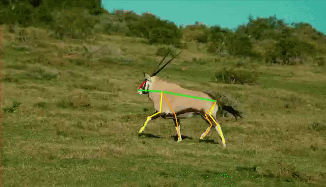
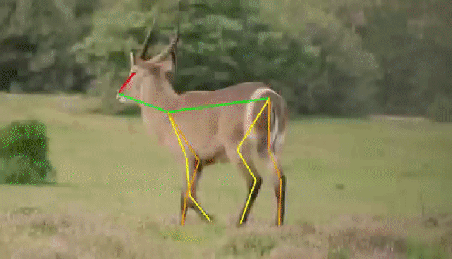
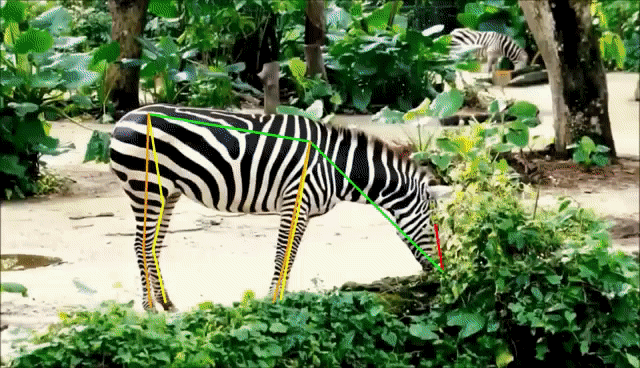
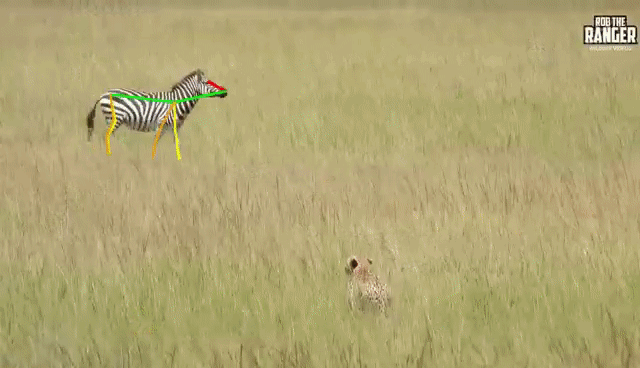
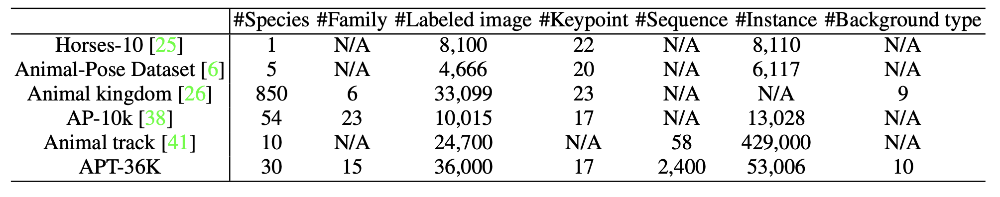

<h1 align="center">APT-36K: A Large-scale Benchmark for Animal Pose Estimation and Tracking</h1>

<a href="https://arxiv.org/abs/2206.05683">.svg" ></a>

<h4 align="center">This is the official repository of the paper <a href="https://arxiv.org/abs/2206.05683">APT-36K: A Large-scale Benchmark for Animal Pose Estimation and Tracking</a>.</h4>
<h5 align="center"><em>Yuxiang Yang, Junjie Yang, Yufei Xu, Jing Zhang, Long Lan, Dacheng Tao</em></h5>

  <a href="#introduction">Introduction</a> |
  <a href="#apt-36k">APT-36K</a> |
  <a href="#demo">Demo</a> |
  <a href="#statement">Statement</a>

## Introduction

<strong>Animal pose estimation and tracking (APT)</strong> is a fundamental task for detecting and tracking animal keypoints from a sequence of video frames. Previous animal-related datasets focus either on animal tracking or single-frame animal pose estimation, and never on both aspects. To fill this gap, we make the first step and propose <strong>APT-36K</strong>, i.e., the first large-scale benchmark for animal pose estimation and tracking. Specifically, APT-36K consists of 2,400 video clips collected and filtered from 30 animal species with 15 frames for each video, resulting in 36,000 frames in total. After manual annotation and careful double-check, high-quality keypoint and tracking annotations are provided for all the animal instances. Based on APT-36K, we benchmark several representative models on the following three tracks: (1) supervised animal pose estimation on a single frame under intra- and inter-domain transfer learning settings, (2) inter-species domain generalization test for unseen animals, and (3) animal pose estimation with animal tracking. Based on the experimental results, we gain some empirical insights and show that APT-36K provides a valuable animal pose estimation and tracking benchmark, offering new challenges and opportunities for future research.Annotated files and corresponding images our datasets can be downloaded at https://1drv.ms/u/s!AimBgYV7JjTlgcZ9zLyl5KnM3dKMgg?e=ik18nm

## APT-36k

 The goal of <strong>APT-36K</strong> is to provide a large-scale benchmark for animal pose estimation and tracking in real-world scenarios, which has been rarely explored in prior art. To this end, we resort to real-world video websites, i.e., YouTube, and carefully collect and filter <strong>2,400</strong> video clips covering <strong>30</strong> different animal species from different scenes, e.g., zoo, forest, and desert. Then we manually set the frame sampling rate for each video to ensure there are noticeable movement and posture differences for each animal in the sub-sampled video clips. Specifically, each clip contains <strong>15</strong> frames after the sampling process.The whole data collection, cleaning, annotation, and check process takes about <strong>2,000</strong> person-hours. A total of <strong>36,000</strong> images are finally labeled, following the COCO labeling format. There are typically <strong>17</strong> keypoints labeled for each animal instance, including two eyes, one nose, one neck, one tail, two shoulders, two elbows, two knees, two hips, and four paws.

## Demo
Here we show some examples from the APT-36K dataset. The motion trajectory of key points of the animal's body in 15 consecutive frames is shown in the third row of images.

## Statement
